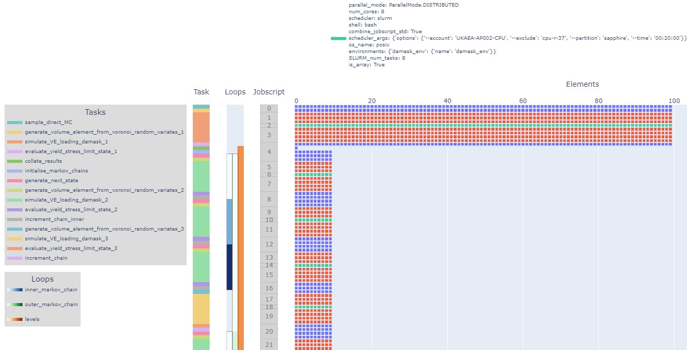

# hfviz

Visualisation tools for hpcflow (and MatFlow) workflows.

Note: this is a work-in-progress and currently works only with the `refactor/jobscript` branch of hpcflow.

Example workflow visualisation showing jobscript allocation:

